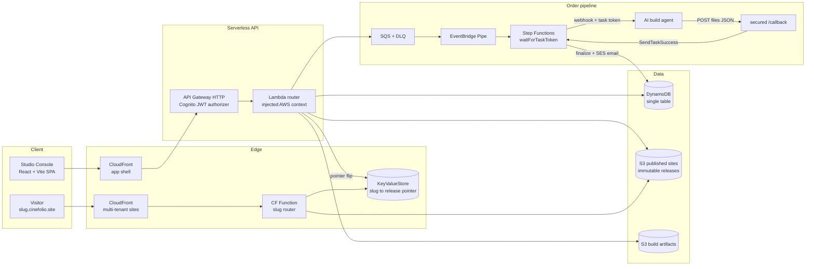

# CineFolio · Portfolio Websites as a Service

**A production-grade, serverless multi-tenant hosting platform on AWS, built and operated end to end by one engineer.** Clients get a cinematic portfolio web app produced by an AI build pipeline; the platform gives them versioned releases, instant rollback, and their own subdomain, at near-zero marginal cost per site.


---

## Why this project is interesting (the engineering)

**1. Immutable releases with atomic pointer flips.**
Every publish writes a new immutable release prefix to S3; going live is a single CloudFront KeyValueStore write that repoints `{slug}.cinefolio.site` at the new prefix. No CloudFront invalidations in the publish path, and rollback to any prior release takes seconds: the same mechanic Vercel uses for deployments, applied to client websites.

**2. Multi-tenant hosting on one distribution.**
One CloudFront distribution serves every tenant. A CloudFront Function resolves the slug against the KeyValueStore and rewrites to the right release prefix at the edge. Adding a customer site costs one DynamoDB item and a few S3 objects; the infrastructure scales to thousands of tenants without a single new resource.

**3. An event-driven AI build pipeline that can never go silent.**
Paid orders flow SQS → EventBridge Pipes → Step Functions. The state machine dispatches the build to an AI agent over a webhook **with a task token** (`waitForTaskToken`), so the execution pauses until the agent POSTs the finished multi-page site back to a secured callback that resumes it. Retries with backoff, a 30-minute build timeout, and a terminal human-review state with SNS paging guarantee every order ends in exactly one of three states: ready, human review, or invalid. Never silence.

**4. 100% Terraform, zero long-lived credentials in CI.**
Nine composable modules (data, identity, api, hosting, pipeline, kms, cicd, observability, appshell) with S3-native state locking. CI deploys assume an IAM role via GitHub OIDC; no access keys exist in the pipeline.

**5. A serverless API designed for testability.**
API Gateway (HTTP API) with a Cognito JWT authorizer fronts a single Lambda router. Every AWS side effect lives behind one injected context object, so the full route surface (27 routes: sites, releases, orders, revisions, profile dossier, stats, domains, admin) runs against in-memory fakes: **21 route-level tests on `node:test`, no mocking frameworks, sub-second suite**.

**6. Operations built in, not bolted on.**
Structured JSON logs, an SSM-backed circuit breaker for the pipeline, DLQ with redrive, budget alarms, fail-soft SES transactional email (an unconfigured sender degrades gracefully, never breaks an order), per-page audience beacons feeding daily DynamoDB counters surfaced as site analytics, honeypot fields on public forms, and constant-time secret comparison on webhook callbacks.

## Architecture



## The product, in one paragraph

Clients build a portfolio in the Studio Console: upload a resume once (a deterministic parser fills a structured profile dossier), pick one of **5 template families × 3 film stocks** rendered live with their own data, and premiere a complete multi-page web app (index plus case-study pages) to `{slug}.cinefolio.site` in one click, free. The paid Director's Cut sends the brief through the Step Functions pipeline to an AI agent that art-directs a bespoke multi-page site and delivers it back through the callback; the client previews the cut in the console and premieres it onto any of their films as the next release. Every film has versioned releases, one-click rollback, unpublish, hard delete, a share kit, view analytics, and a one-included-revision flow enforced race-safe server-side.

## Stack

| Layer | Choices |
|---|---|
| Infrastructure | Terraform (9 modules), AWS eu-central-1, S3-native state locking |
| Compute | Lambda (Node 20, ESM), Step Functions, EventBridge Pipes |
| Edge | CloudFront ×2, CloudFront Functions, KeyValueStore |
| Data | DynamoDB single-table (GSI overloading), S3 ×3 (KMS on private, SSE-S3 on public) |
| Auth | Cognito user pool, JWT authorizer at the gateway, admin group checks in-handler |
| Messaging | SQS + DLQ, SNS operator paging, SES transactional email (fail-soft) |
| CI/CD | GitHub Actions via OIDC role assumption, plan-on-PR |
| Frontend | React 18 + Vite SPA, zero UI framework, design-token CSS system |
| Testing | node:test route-level suite against in-memory fakes (21 tests) |

## Repository layout

```
infra/
  envs/dev/            # environment composition (terraform plan/apply here)
  modules/
    api/               # HTTP API + Lambda router + route tests
    pipeline/          # SQS, Pipes, Step Functions, build worker
    hosting/           # multi-tenant CloudFront + KVS slug router
    data/ identity/ kms/ cicd/ observability/ appshell/
app/                   # Studio Console SPA (React + Vite)
  src/pages/           # My Films, The Set, My Profile, Account, Floor (admin)
  src/templates/       # deterministic site engine: 5 families, bundle compiler
index.html             # public marketing landing
```

## Run it

```bash
# infrastructure (once: make bootstrap for the state bucket)
terraform -chdir=infra/envs/dev init
terraform -chdir=infra/envs/dev plan
terraform -chdir=infra/envs/dev apply

# API tests
cd infra/modules/api/lambda && node --test

# console
cd app && npm install && npm run build && ./deploy.sh
```

## Selected design decisions

- **Two-step delete**: only an unpublished site can be hard-deleted, so a stray click can never kill a live premiere. Deletion burns releases, rows, S3 objects, and frees the slug.
- **Fail-soft email doctrine**: money flows never depend on the mail provider; an unverified SES identity means no email, never a failed order.
- **UI-first contracts**: the console ships against the API contract it expects; unwired routes degrade to honest fallbacks (a local order ledger, a contact-channel fallback for revisions) and light up on deploy.
- **Beacon at publish time**: analytics injection happens server-side on every release, so free-engine sites and AI-built cuts count views identically, with no client SDK.

## Roadmap

Living Portfolio refreshes from public GitHub data, Pro and hosting-renewal tiers via Lemon Squeezy webhooks, a creator template marketplace, teaser-reel exports, and a curated public premieres directory.

---

Built and operated by **Mohammed Ait El Qadi**, DevOps and Platform Engineer.
[aitelqadi.dev](https://www.aitelqadi.dev) · [GitHub](https://github.com/AitelqadiMo) · [LinkedIn](https://www.linkedin.com/in/mohammed-ait-el-qadi)

© 2026 Mohammed Ait El Qadi. All rights reserved.
